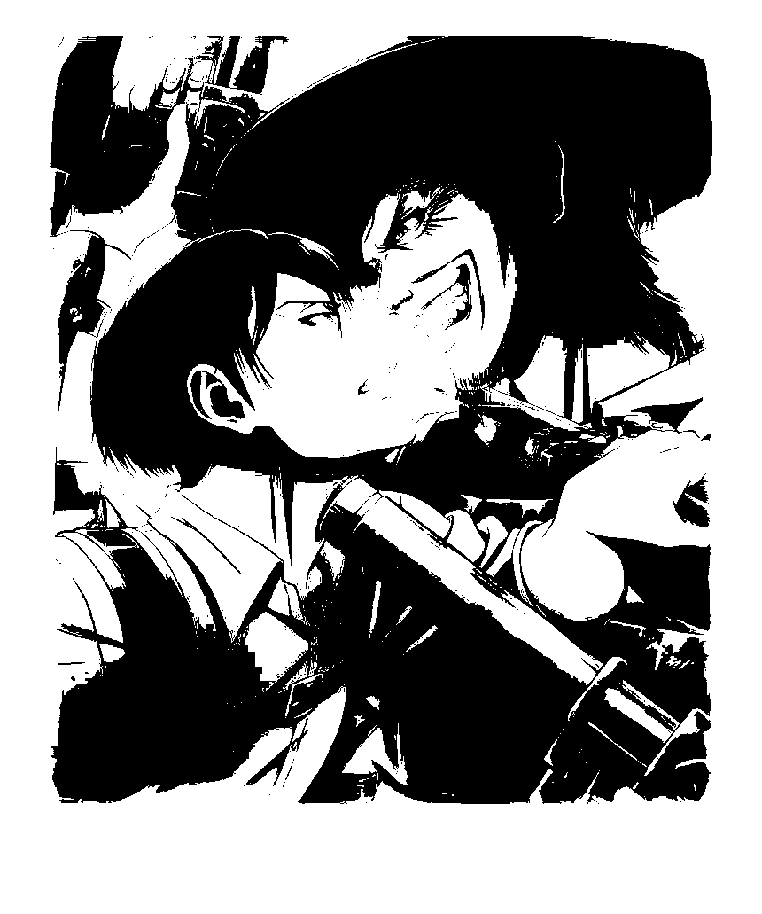
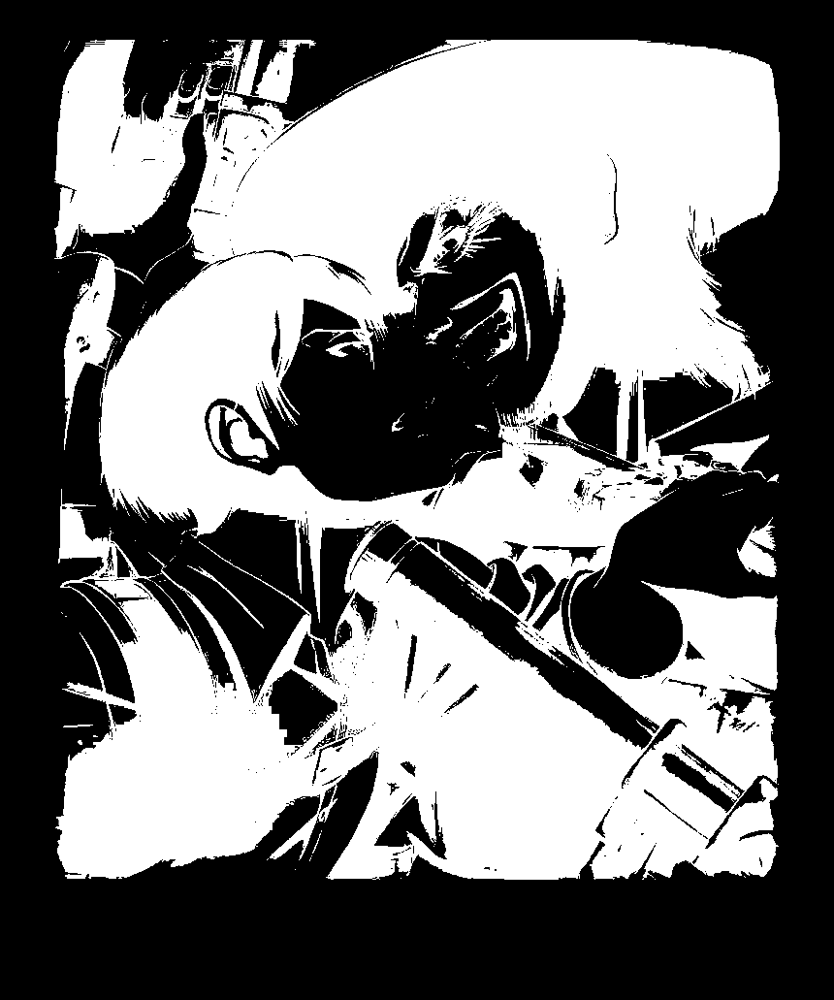
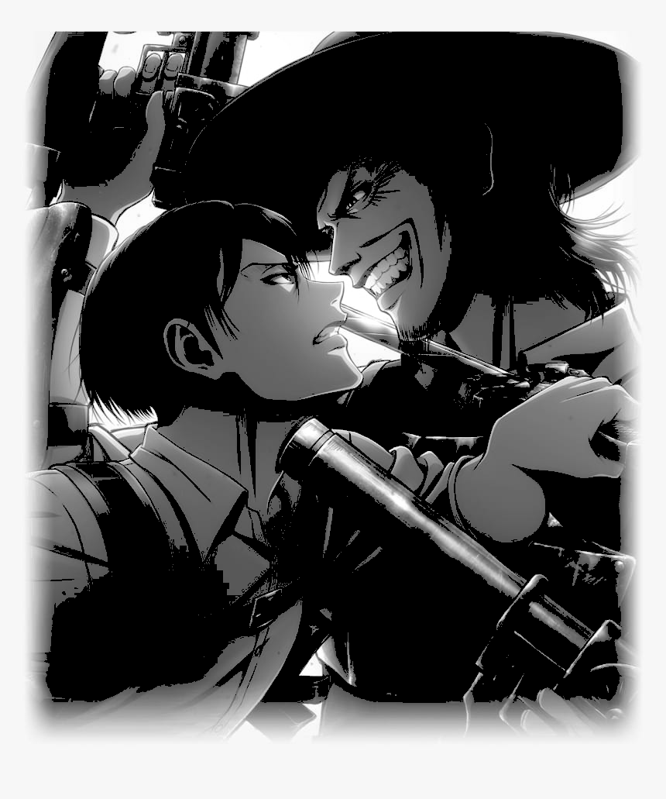
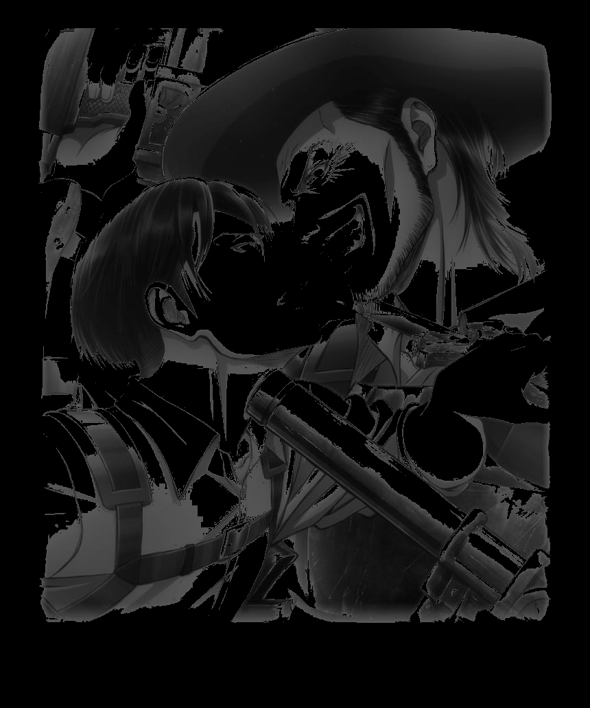
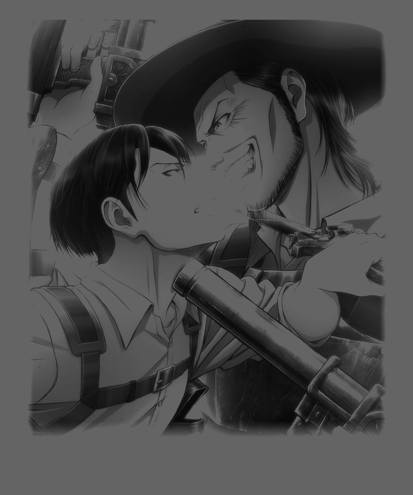
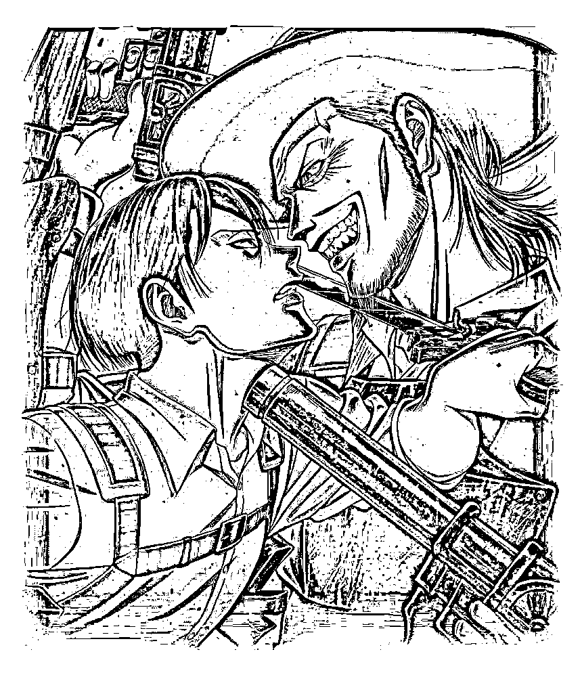
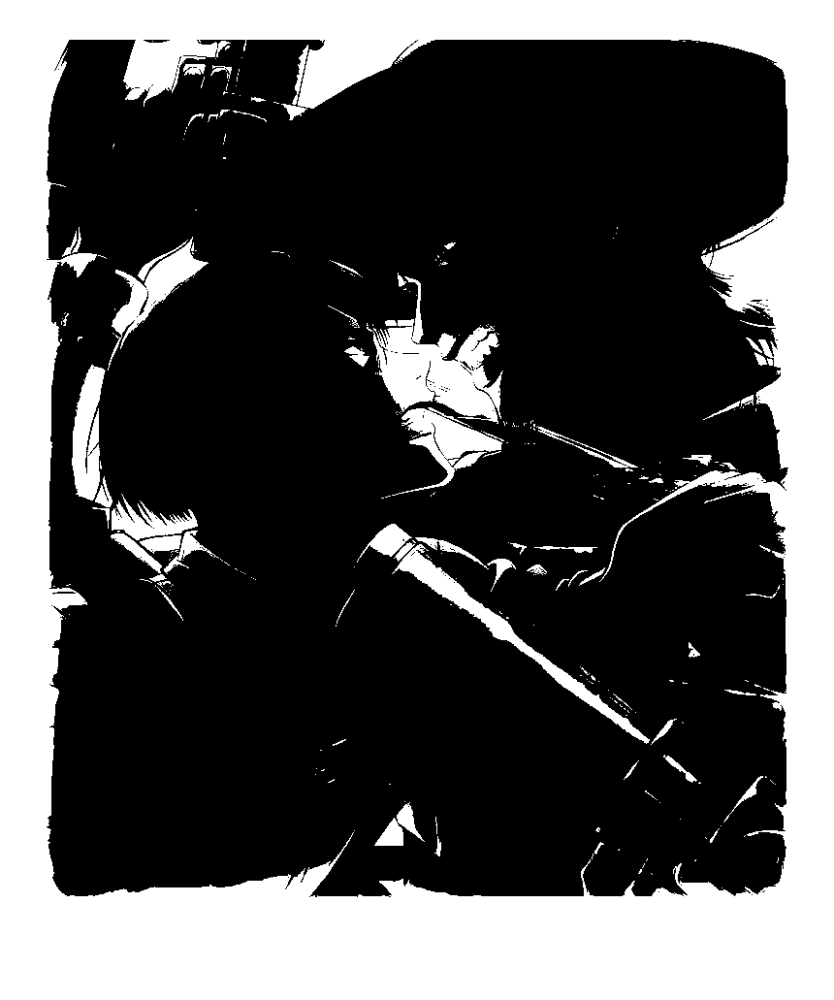

# Thresholding of Images

## Aim

To segment the image using global thresholding, adaptive thresholding and Otsu's thresholding using python and OpenCV.

## Software Required

1. Anaconda - Python 3.7
2. OpenCV

## Algorithm

### Step1:

Load the necessary packages.
<br>

### Step2:

Read the Image and convert to grayscale.
<br>

### Step3:

Use Global thresholding to segment the image.
<br>

### Step4:

Use Adaptive thresholding to segment the image.
<br>

### Step5:

Use Otsu's method to segment the image.
<br>

### Step 6:

Display the results.
<br>

## Program

## Developed By: SRIJITH R

## Reg No: 212221240054

<br>

### Load the necessary packages

```python
import cv2
import numpy as np
import matplotlib.pyplot as plt
```

### Read the Image and convert to grayscale

```python
ori_img=cv2.imread('kenny.jpg')
ori_img=cv2.resize(ori_img,(460,250))
gray_img=cv2.cvtColor(ori_img,cv2.COLOR_BGR2GRAY)
```

<br>

### Use Global thresholding to segment the image

```python
ret,thresh_img1=cv2.threshold(gray_img,86,255,cv2.THRESH_BINARY)
ret,thresh_img2=cv2.threshold(gray_img,86,255,cv2.THRESH_BINARY_INV)
ret,thresh_img3=cv2.threshold(gray_img,86,255,cv2.THRESH_TOZERO)
ret,thresh_img4=cv2.threshold(gray_img,86,255,cv2.THRESH_TOZERO_INV)
ret,thresh_img5=cv2.threshold(gray_img,100,255,cv2.THRESH_TRUNC)
```

<br>

### Use Adaptive thresholding to segment the image

```python
thresh_img6=cv2.adaptiveThreshold(gray_img,255,cv2.ADAPTIVE_THRESH_MEAN_C,cv2.THRESH_BINARY,11,2)
thresh_img7=cv2.adaptiveThreshold(gray_img,255,cv2.ADAPTIVE_THRESH_GAUSSIAN_C,cv2.THRESH_BINARY,11,2)
```

<br>

### Use Otsu's method to segment the image

```python
ret,thresh_img8=cv2.threshold(gray_img,0,255,cv2.THRESH_BINARY+cv2.THRESH_OTSU)
```

<br>

### Display the images

```python
cv2.imshow('original',ori_img)
cv2.imshow('gray',gray_img)
cv2.imshow('binary threshold',thresh_img1)
cv2.imshow('binary to inverse threshold',thresh_img2)
cv2.imshow('to zero threshold',thresh_img3)
cv2.imshow('to zero to inverse threshold',thresh_img4)
cv2.imshow('truncate threshold',thresh_img5)
cv2.imshow('mean adaptive threshold',thresh_img6)
cv2.imshow('gaussian adaptive threshold',thresh_img7)
cv2.imshow('otsu thresold',thresh_img8)
cv2.waitKey(0)
cv2.destroyAllWindows()
```

<br>

## Output


Original                            | Gray Image                                 |               
:------------------------------------------:|:--------------------------------------------:
 |  |

### Global Thresholding

Gray Image                         | Binary Thresholding                               | Binary Thresholding - Inverse                        |               
:------------------------------------------:|:------------------------------------------:|:--------------------------------------------:
 |  |  |


Truncate Thresholding | To Zero Thresholding                                 | To Zero Thresholding - Inverse             |               
:------------------------------------------:|:------------------------------------------:|:--------------------------------------------:
 |  |  |


### Adaptive Thresholding
Adaptive Thresholding - Mean                      | Adaptive Thresholding - Gaussian       |               
:------------------------------------------:|:--------------------------------------------:
 |  |

### Otsu's Thresholding

Original                            | Gray Image                                 |               
:------------------------------------------:|:--------------------------------------------:
 |  |
## Result

Thus the images are segmented using global thresholding, adaptive thresholding and optimum global thresholding using python and OpenCV.